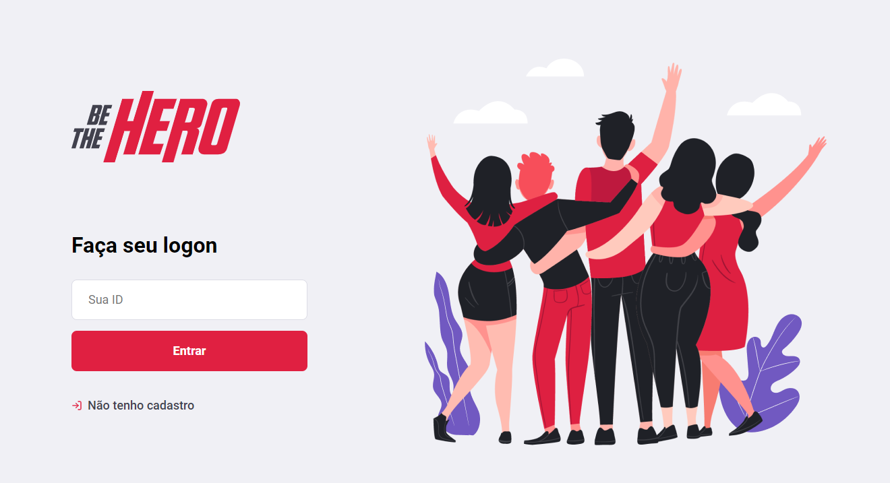

# semanaomnistack11

Finalizado com suor e com sucesso a aplicação BE THE HERO, proposta como projeto de estudo na #SemanaOmniStack 11 da Rocketseat, ensinado com maestria pelo Diego Schell Fernandes.

A aplicação-estudo tem como proposta ser um canal onde ONGs podem cadastrar seus casos que precisam de ajuda e os usuários/heróis podem entrar em contato para ajudar.

Estudamos os conceitos de #backend com #NodeJs, #frontend com #ReactJs e #mobile com #ReactNative, e banco de dados #sqlite

De quebra, aprendemos também a utilizar o #github, e finalmente eu comecei a movimentar o meu repositório, hehe.

Minha ideia é continuar estudando e trabalhar em cima do código aprendido na Semana OmniStack, transformando numa aplicação real em breve.

Valeu pessoal da Rocketseat e aos milhares de "colegas" que participaram da Semana OmniStack, trocando dúvidas, dicas, ideias e ajuda.

#javascritp #js #fullstack #semanaomnistack #rocketseat #npm #expo

